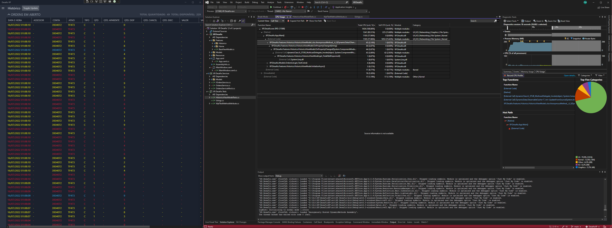
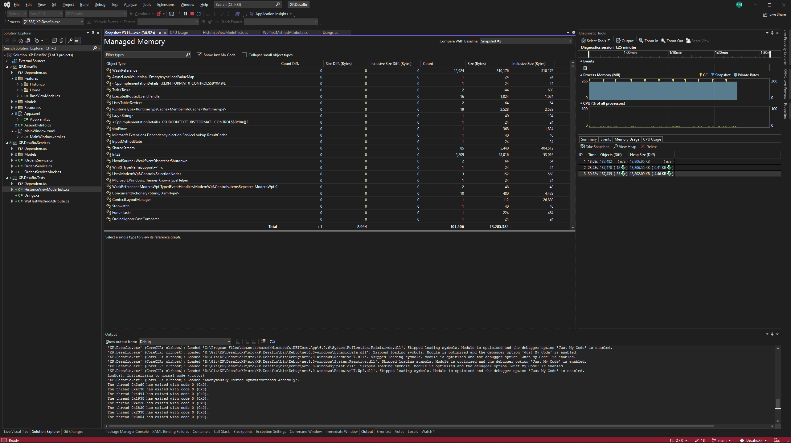

# DesafioXP

Código feito para o teste técnico da XP

## Descrição 

App desenvolvido utilizando 
- WPF (Windows Presentation Foundation)
- ReactiveUI
- DynamicData
- Microsoft CommunityToolkit
- ModernWpfUI

## Mock
Foi desenvolvido um Mock para OrdensService, onde esta sendo gerado Ordens com valores aleatorios, apenas para simular a adicao/atualizacao dos elementos da lista.

## Testes
So foi desenvolvido o teste para a ViewModel de Historico (Unica tela requisitada para o teste).

O servico real deveria buscar informacoes da bolsa, mas nao foi implementado, apenas o Mock.

# Performance

Fiz um snapshot do uso de memoria e do CPU, com a intencao de encontrar os pontos de possiveis gargalos, seja por processamento, ou leak de memoria.

Conforme as imagens, o uso de CPU se manteve baixo, sem picos de processamento, e a maior parte do processamento foi devido a renderizacao da tela.

No lado da memoria, a utilizacao se manteve constante, mesmo com a atualizacao dos itens realizadas constantemente, indicando que nao houve leak de memoria.

## Observações
O teste foi desenvolvido em 3 dias no meu tempo livre, pois estava de ferias ao recebe-lo, e decidi iniciar somente ao terminar minha viagem.

## License
[MIT](https://choosealicense.com/licenses/mit/)
